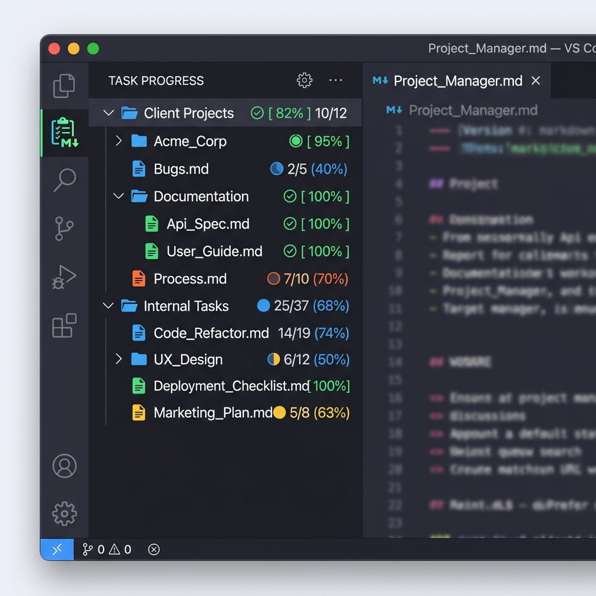

# Markdown Task Tracker

Markdown Task Tracker is a VS Code extension that helps you track your task progress across markdown files in your workspace. It provides a dedicated view in the Activity Bar to visualize your task completion status at a glance.

## Features

### 📂 Hierarchical Tree View
Tasks are organized by your workspace's folder structure. Folders aggregate the progress of all markdown files within them, helping you see the overall status of different projects or components.

### 🔍 Flexible Checkbox Detection
Works with all common markdown checkbox styles! It detects `[]`, `[ ]`, and `[x]` whether they are part of a standard list (`-`, `*`, `1.`) or just free-standing in your text.

### 🎨 Color-coded Progress
Visual feedback from red to green:
- **Red**: 0% completed
- **Orange**: 1% - 39% progress
- **Yellow**: 40% - 69% progress
- **Blue**: 70% - 99% progress
- **Green**: 100% completed!
Progress percentages are displayed as badges next to filenames and folders.

### 🔄 Automatic Updates
The view refreshes automatically whenever you save a markdown file, keeping your progress up to date in real-time.

## Installation

1. Install the [**Markdown Task Tracker**](https://marketplace.visualstudio.com/items?itemName=AshinaLabs.ashina-task-tracker) from the VS Code Marketplace.
2. Click the **MD Tasks** icon in the Activity Bar on the left side of your editor.
3. Your markdown files containing task checkboxes will automatically appear in the tree view.

## Extension Settings

You can exclude specific paths from task tracking by adding them to the `mdTaskTracker.excludePaths` setting in your `settings.json`.

## Release Notes

### 0.1.1
- Hierarchical folder/file tree view.
- Flexible checkbox detection.
- Color-coded progress status via File Decorations.
- Context menu options to exclude files or folders.
- Automatic refresh on file save.

---

**Enjoy tracking your tasks!**
